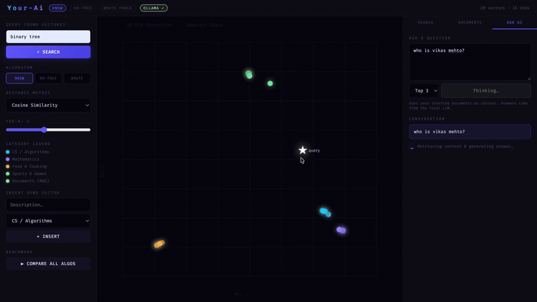

# VectorDB - AI Powered Semantic Search Engine

## Overview

VectorDB is a C++ based semantic search engine that demonstrates how modern vector databases retrieve information using embedding vectors instead of traditional keyword matching. The project integrates multiple nearest-neighbor search algorithms with a Retrieval-Augmented Generation (RAG) pipeline powered by Ollama.

It provides an interactive web interface where users can insert documents, perform semantic searches, compare search algorithms, and ask questions about stored documents using a locally running LLM.

---

## Demo



> 📺 **Full walkthrough video:** [Watch on YouTube](https://youtu.be/T1PRqepUZJE?si=NtL4Kg-Pew11ndVl)

---

## Features

- Semantic vector search using **HNSW**, **KD-Tree**, and **Brute Force**
- Multiple similarity metrics:
  - Cosine Similarity
  - Euclidean Distance
  - Manhattan Distance
- Local document embedding using Ollama
- Retrieval-Augmented Generation (RAG)
- Interactive web dashboard
- REST API for document management and search
- Algorithm benchmarking and performance comparison

---

## Tech Stack

### Languages
- C++17
- HTML
- CSS
- JavaScript

### Libraries
- cpp-httplib
- Ollama API

### AI Models
- nomic-embed-text
- llama3.2

---

## Project Architecture

```text
User
   │
   ▼
Web Interface
   │
   ▼
HTTP Server (C++)
   │
   ├── HNSW Search
   ├── KD-Tree Search
   ├── Brute Force Search
   │
   ▼
Ollama
   ├── Embedding Model
   └── LLM
   │
   ▼
Generated Response
```

---

## Project Structure

```text
VectorDB/
├── main.cpp
├── httplib.h
├── index.html
└── README.md
```

---

## How to Run

### Clone Repository

```bash
git clone <repository-url>
cd VectorDB
```

### Compile

```bash
g++ -std=c++17 main.cpp -o db
```

### Start Ollama

```bash
ollama serve
```

### Run Server

```bash
./db
```

Open your browser:

```text
http://localhost:8080
```

---

## Workflow

1. Start the server.
2. Insert a document.
3. Generate embeddings using Ollama.
4. Perform semantic search.
5. Ask questions using the RAG interface.
6. Compare search algorithms.

---

## Technical Highlights

- Built three nearest-neighbor search algorithms in C++.
- Integrated local embedding generation using Ollama.
- Implemented a Retrieval-Augmented Generation (RAG) pipeline.
- Developed a web interface for document search and benchmarking.
- Designed REST APIs for vector search and document management.

---

## Future Improvements

- Persistent vector storage
- Metadata filtering
- Support for larger datasets
- Additional ANN algorithms
- GPU acceleration

---

## Why This Project?

This project was developed to understand the internal implementation of vector databases and Retrieval-Augmented Generation systems by building the core components from scratch in C++ rather than relying on existing vector database frameworks.
